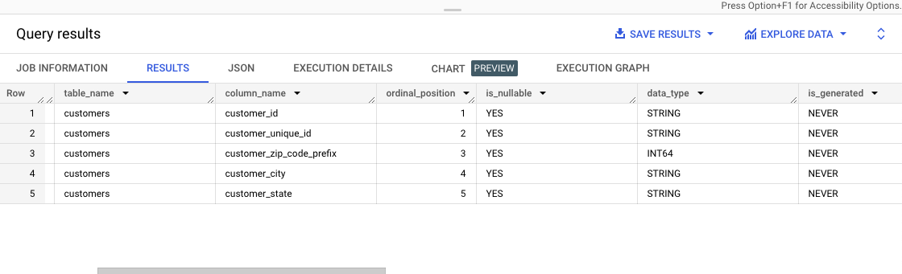
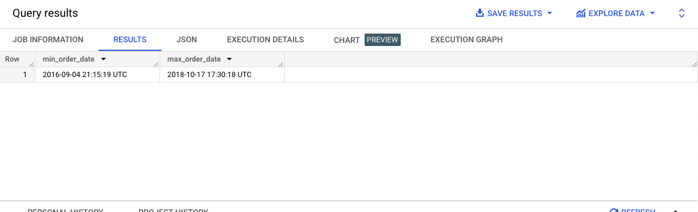
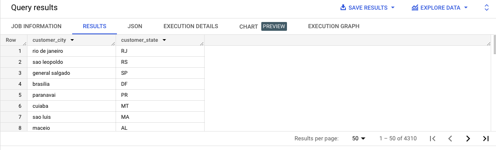
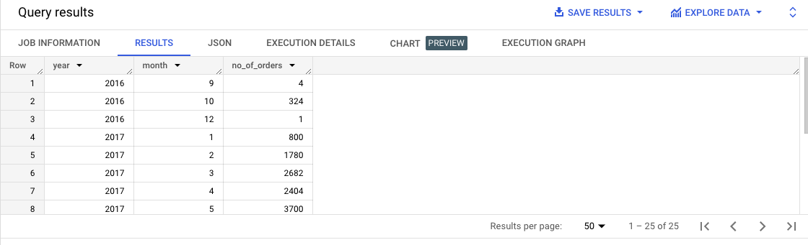
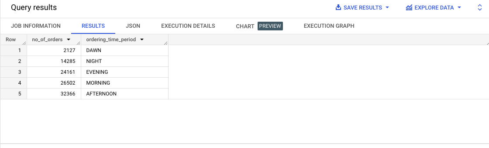
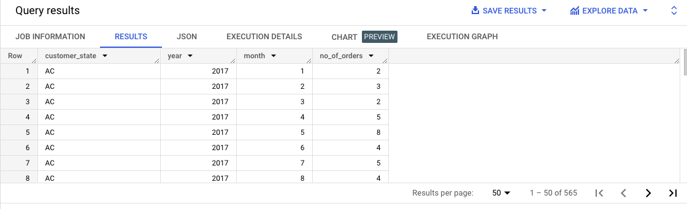
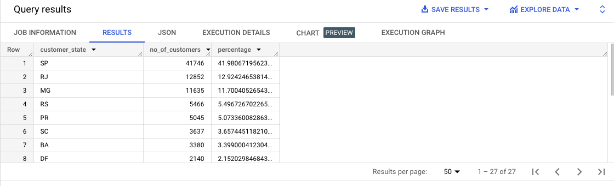
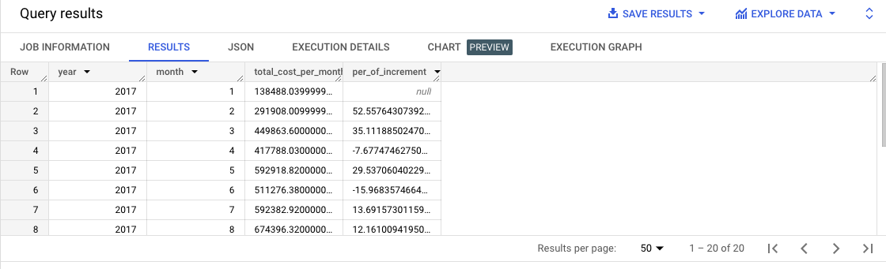
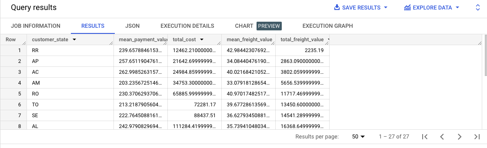
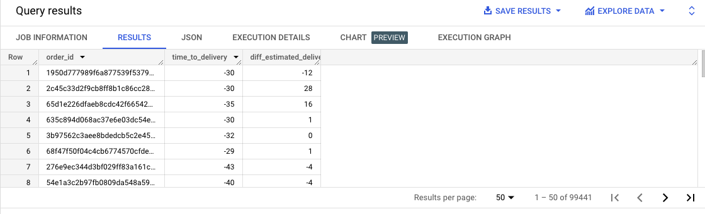

# Brazilian e-commerce orders (made at Olist Store) Analysis

## Project Title : 
Brazilian e-commerce Orders Analysis - Using SQL

## About Dataset:
Welcome! This is a Brazilian e-commerce public dataset of orders made at Olist Store. The dataset has information on 100k orders from 2016 to 2018 made at multiple marketplaces in Brazil. Its features allow viewing orders from various dimensions: from order status, price, payment, and freight performance to customer location, product attributes, and finally reviews written by customers. 

Analyzing this extensive dataset makes it possible to gain valuable insights. The information can shed light on various aspects of the business, such as order processing, pricing strategies, payment and shipping efficiency, customer demographics, product characteristics, and customer satisfaction levels.

## Data set
The data is available in 8 CSV files:

- customers.csv
- sellers.csv
- order_items.csv
- geolocation.csv
- payments.csv
- reviews.csv
- orders.csv
- products.csv

The customers.csv contains the following features:

Features                  | Description
-------------             | -------------
customer_id               | ID of the consumer who made the purchase
customer_unique_id        | Unique ID of the consumer
customer_zip_code_prefix  | Zip Code of consumer’s location
customer_city             | Name of the City from where an order is made
customer_state            | State Code from where the order is made (Eg. são Paulo - SP)


The sellers.csv contains the following features:

Features                    | Description
-------------               | -------------
seller_id                   | Unique ID of the seller registered
seller_zip_code_prefix      | Zip Code of the seller’s location
seller_city                 | Name of the City of the seller
seller_state                | State Code (Eg. são paulo - SP)

The order_items.csv contains the following features:

Features                    | Description
-------------               | -------------
order_id                    | A Unique ID of the order made by the consumers
order_item_id               | A Unique ID is given to each item ordered in the order
product_id                  | A Unique ID given to each product available on the site
seller_id                   | Unique ID of the seller registered
shipping_limit_date         | The date before which the ordered product must be shipped
price                       | Actual price of the products ordered
freight_value               | Price rate at which a product is delivered from one point to another


The geolocations.csv contains the following features:

Features                        | Description
-------------                   | -------------
geolocation_zip_code_prefix     | First 5 digits of Zip Code
geolocation_lat                 | Latitude
geolocation_lng                 | Longitude
geolocation_city                | City
geolocation_state               | State


The payments.csv contains the following features:

Features                        | Description
-------------                   | -------------
order_id                        | A Unique ID of order made by the consumers
payment_sequential              | Sequences of the payments made in case of EMI
payment_type                    | Mode of payment used (Eg. Credit Card)
payment_installments            | Number of installments in case of EMI purchase
payment_value                   | Total amount paid for the purchase order


The orders.csv contains the following features:

Features                        | Description
-------------                   | -------------
order_id                        | A Unique ID of the order made by the consumers
customer_id                     | ID of the consumer who made the purchase
order_status                    | Status of the order made i.e. delivered, shipped, etc.
order_purchase_timestamp        | Timestamp of the purchase
order_delivered_carrier_date    | Delivery date at which the carrier made the delivery
order_delivered_customer_date   | Date on which the customer got the product
order_estimated_delivery_date   | Estimated delivery date of the products


The reviews.csv contains the following features:

Features                        | Description
-------------                   | -------------
review_id                       | ID of the review given on the product ordered by the order id
order_id                        | A Unique ID of order made by the consumers
review_score                    | Review score given by the customer for each order on a scale of 1-5
review_comment_title            | Title of the review
review_comment_message          | Review comments posted by the consumer for each order
review_creation_date            | Timestamp of the review when it is created
review_answer_timestamp         | Timestamp of the review answered


The products.csv contains the following features:

Features                        | Description
-------------                   | -------------
product_id                      | A Unique identifier for the proposed project.
product_category_name           | Name of the product category
product_name_lenght             | Length of the string that specifies the name given to the products ordered
product_description_lenght      | Length of the description written for each product ordered on the site
product_photos_qty              | Number of photos of each product ordered available on the shopping portal
product_weight_g                | Weight of the products ordered in grams
product_length_cm               | Length of the products ordered in centimeters
product_height_cm               | Height of the products ordered in centimeters
product_width_cm                | Width of the product ordered in centimeters

#### Schema


## Analysis
1. The data type of columns in a table

```
SELECT * FROM `TABLE_CATALOG.TABLE_SCHEMA.INFORMATION_SCHEMA.COLUMNS` 
WHERE table_catalog='TABLE_CATALOG' and table_schema='TABLE_SCHEMA' and table_name='customers';
```
Here
- TABLE_CATALOG: The project ID of the project that contains the dataset
- TABLE_SCHEMA: The name of the dataset that contains the table also referred to as the datasetId

Output:


Similarly, we can check for other tables as well. 

2. Time period for which the data is given

```
SELECT MIN(order_purchase_timestamp) AS min_order_date , MAX(order_purchase_timestamp) AS max_order_date FROM `ecomm.orders`
```

Max date: 2018-10-17 17:30:18 UTC
Min date: 2016-09-04 21:15:19 UTC
Observation: Order data between 09/2016 to 10/2018

Output:


3. Cities and States of customers ordered during the given period

```
SELECT  DISTINCT c.customer_city,c.customer_state FROM `target.orders` AS o INNER JOIN `target.customers` c ON o.customer_id = c.customer_id WHERE EXTRACT (YEAR FROM o.order_purchase_timestamp) BETWEEN 2016 AND 2018
```

Output:


4. Checking orders growing trend on e-commerce in Brazil. And checking seasonality with peaks at specific months.

```
SELECT EXTRACT(YEAR FROM o.order_purchase_timestamp) AS year,EXTRACT (MONTH FROM o.order_purchase_timestamp) AS month, COUNT(o.order_id) AS no_of_orders FROM `ecomm.orders` AS o GROUP BY 1, 2 ORDER BY 1, 2;
```

Output:


- Orders trends increasing from 01/2017 to 11/2017
- Orders trends decreasing from 03/2018 to 07/2018
- Maximum orders in 11/2017
- Minimum orders in 12/2016

5. What time do Brazilian customers tend to buy (Dawn, Morning, Afternoon or Night)?

```
SELECT COUNT(o.order_purchase_timestamp) AS no_of_orders,
CASE
 WHEN EXTRACT(HOUR FROM o.order_purchase_timestamp) >= 4 AND EXTRACT(HOUR FROM o.order_purchase_timestamp) <= 7 THEN 'DAWN'
 WHEN EXTRACT(HOUR FROM o.order_purchase_timestamp) >= 8 AND EXTRACT(HOUR FROM o.order_purchase_timestamp) <= 12 THEN 'MORNING'
 WHEN EXTRACT(HOUR FROM o.order_purchase_timestamp) >= 13 AND EXTRACT(HOUR FROM o.order_purchase_timestamp) <= 17 THEN 'AFTERNOON'
 WHEN EXTRACT(HOUR FROM o.order_purchase_timestamp) >= 18 AND EXTRACT(HOUR FROM o.order_purchase_timestamp) <= 21 THEN 'EVENING'
 ELSE 'NIGHT'
END AS ordering_time_period
FROM `ecomm.orders` o
GROUP BY ordering_time_period
ORDER BY no_of_orders;
```

Output:


Here I assume  DAWN is from 4:00 AM to 7:59 AM, Morning is from 8:00 AM to 12:59 PM, AFTERNOON is from 13:00 PM to 17:59 PM, 
EVENING is from 18:00 PM to 21:PM, and the other time is at NIGHT. 


- Most of the orders (ie. 32,366) were placed in the afternoon. Here I have assumed the afternoon time period 13:00 to 17:00 (include both)
- Least orders (2127) were placed in the DAWN. Here I have assumed the DAWN time period is 4:00 AM to 7:59 AM (including both)

6. Month-on-month orders by states

```
SELECT c.customer_state, EXTRACT(YEAR FROM o.order_purchase_timestamp) AS year,EXTRACT (MONTH FROM o.order_purchase_timestamp) AS month, COUNT(o.order_id) AS no_of_orders
FROM `ecomm.orders` AS o
INNER JOIN `ecomm.customers` AS c
ON o.customer_id = c.customer_id
GROUP BY 1, 2, 3
ORDER BY 1, 2, 3;
```

Output:


7. Distribution of customers across the states in Brazil

```
WITH my_cte AS (
SELECT COUNT(DISTINCT(c.customer_id)) AS total_no_of_customers
FROM `target.orders` o
INNER JOIN `target.customers` c
ON o.customer_id = c.customer_id
)


SELECT c.customer_state,
COUNT(DISTINCT(c.customer_id)) AS no_of_customers,
(COUNT(DISTINCT(c.customer_id))/ (SELECT total_no_of_customers FROM my_cte))*100 AS percentage
FROM `target.orders` o
INNER JOIN `target.customers` c
ON o.customer_id = c.customer_id
GROUP BY c.customer_state
ORDER BY no_of_customers DESC;
```

Output:


8. Get % increase in cost of orders from 2017 to 2018 (include months between Jan to Aug only) - You can use the “payment_value” column in the payments table

```

WITH order_analysis AS (
SELECT
EXTRACT(YEAR FROM o.order_purchase_timestamp) AS year,
EXTRACT(MONTH FROM o.order_purchase_timestamp) AS month,
SUM(p.payment_value) total_cost_per_month,
FROM `ecomm.orders` o
INNER JOIN `ecomm.payments` p
ON o.order_id = p.order_id
WHERE DATE(o.order_purchase_timestamp) BETWEEN DATE('2017-01-01') AND DATE('2018-08-01')
GROUP BY year,month
ORDER BY year,month
)

SELECT oa.year,oa.month,oa.total_cost_per_month,
((oa.total_cost_per_month - LAG(oa.total_cost_per_month)  OVER(ORDER BY oa.year,oa.month))/oa.total_cost_per_month)*100 AS per_of_increment FROM order_analysis oa
ORDER BY oa.year,oa.month
```
Output:


9. Mean & Sum of price and freight value by customer state

```
SELECT  c.customer_state,
AVG(p.payment_value) AS mean_payment_value,
SUM(p.payment_value) AS total_cost ,
AVG(oi.freight_value) AS mean_freight_value,
SUM(oi.freight_value) AS total_freight_value
FROM `target.orders` o
INNER JOIN `target.customers` c
ON o.customer_id = c.customer_id
INNER JOIN `target.payments` p
ON o.order_id = p.order_id
INNER JOIN `target.order_items` oi
ON o.order_id = oi.order_id
GROUP BY c.customer_state
ORDER BY total_cost
```

Output:


10. Analysis of sales, freight, and delivery time
- Calculate days between purchasing, delivering, and estimated delivery
- Find time_to_delivery & diff_estimated_delivery. The formula for the same given

```
SELECT o.order_id,
DATE_DIFF(o.order_purchase_timestamp, o.order_delivered_customer_date, DAY) AS time_to_delivery,
DATE_DIFF(o.order_estimated_delivery_date, o.order_delivered_customer_date , DAY) AS diff_estimated_delivery
FROM `ecomm.orders` o;
```

Output:


